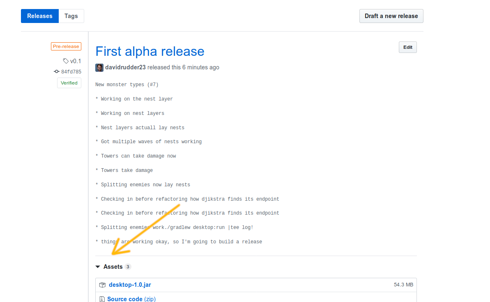

# HomeDefense - The Runup to War

This is the Github repo for `HomeDefense - The Runup to War`.  This is an early alpha release.  I primarily built it to make it easier to share with people.

## Java

You need Java, version 8 or higher, to run this game.  Please follow the instructions for your operating system on running it.

## Downloading and running the Pre-built Game

Go to the `Releases` tab, find the latest release and look for the `Assets` section. Open it up and download the jar file.  



The, run it like:

```
java -jar desktop-1.0.jar
```

## Downloading the source and building

Download the code by forking and/or cloning the project.  Then, run by doing:

```
./gradlew desktop:run
```

For more running options, see [the libgdx instructions](https://github.com/libgdx/libgdx/wiki/Gradle-on-the-Commandline)

## Running on android

To run on android, you need the [android development environment](https://developer.android.com/studio) setup and `developer mode` enabled on your phone.  Then, use `adb` to install the app on your phone.
